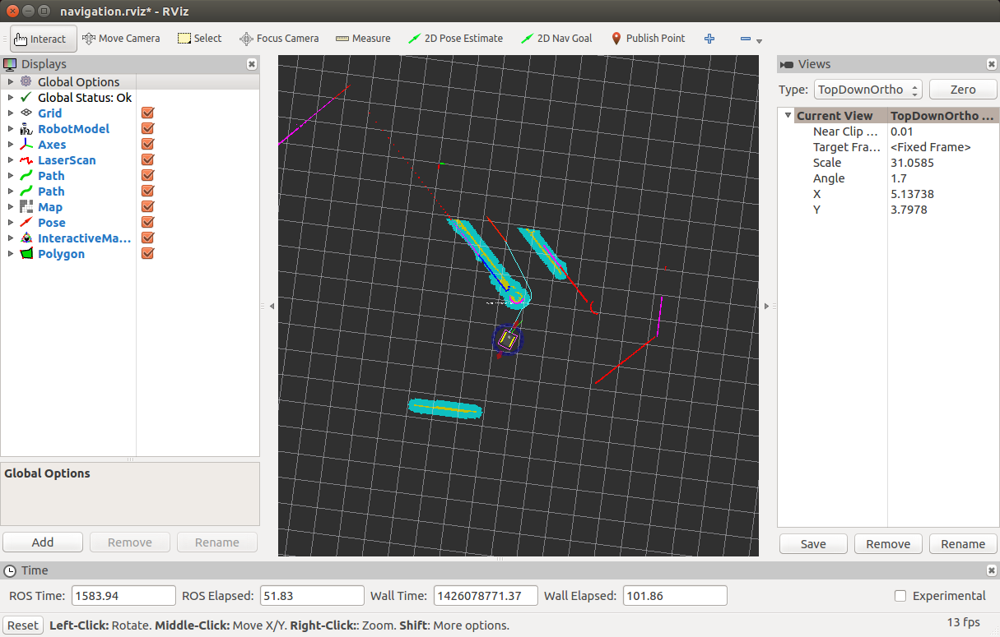
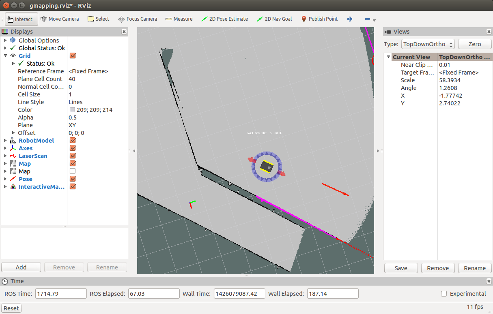

Navigating with Jackal
======================

Below are the example launch files for three different configurations for navigating Jackal:

- Navigation in an odometric frame without a map, using only :roswiki:`move_base`.
- Generating a map using :roswiki:`gmapping`.
- Localization with a known map using :roswiki:`amcl`.

If you're using :doc:`simulation <simulation>`, bring up Jackal with the front laser enabled for the
following demos:

.. code-block:: bash

    roslaunch jackal_gazebo jackal_world.launch config:=front_laser

If you're working with a real Jackal, it's suggested to connect via SSH and launch the :roswiki:`jackal_navigation`
launchfiles from on board the robot. You'll need to have bidirectional communication with the robot's
roscore in order to launch :roswiki:`rviz` on your workstation (see :ref:`remote`).

Navigation Without a Map
------------------------

In the odometry navigation demo Jackal attempts to reach a given goal in the world within a user-specified
tolerance. The 2D navigation, generated by move_base, takes in information from odometry, laser scanner, and a
goal pose and outputs safe velocity commands. In this demo the configuration of move_base is set for navigation
without a map in an odometric frame (that is, without reference to a map).

To launch the navigation demo, run:

.. code-block:: bash

    roslaunch jackal_navigation odom_navigation_demo.launch

To visualize with the suggested rviz configuration launch:

.. code-block:: bash

    roslaunch jackal_viz view_robot.launch config:=navigation

To send goals to the robot, select the *2D Nav Goal* tool from the top toolbar, and then click anywhere in the rviz
view to set the position. Alternatively, click and drag slightly to set the goal position and orientation.

If you wish to customize the parameters of move_base, local costmap, global costmap and base_local_planner, clone
:roswiki:`jackal_navigation` into your own workspace and modify the corresponding files in the `params` subfolder.

Making a Map
------------

In this demonstration, Jackal generates a map using gmapping. Begin by launch the gmapping launch file on the robot:

.. code-block:: bash

    roslaunch jackal_navigation gmapping_demo.launch

And on your workstation, launch rviz with the suggested configuration:

.. code-block:: bash

    roslaunch jackal_viz view_robot.launch config:=gmapping

You must slowly drive Jackal around to build the map. As obstacles come into view of the laser scanner, they will be
added to the map, which is shown in rviz. You can either drive manually using the interactive markers, or
semi-autonomously by sending navigation goals (as above).

When you're satisfied, you can save the produced map using map_saver_:

.. code-block:: bash

    rosrun map_server map_saver -f mymap

This will create a ``mymap.yaml`` and ``mymap.pgm`` file in your current directory.

.. _map_saver: http://wiki.ros.org/map_server#map_saver

Navigation With a Map
---------------------

Using :roswiki:`amcl`, Jackal is able to globally localize itself in a known map. AMCL takes in information
from odometry, laser scanner and an existing map and estimates the robot's pose.

To start the AMCL demo:

.. code-block:: bash

    roslaunch jackal_navigation amcl_demo.launch [map_file:=/path/to/my/map.yaml]

If you don't specify ``map_file``, it defaults to an included pre-made map of the default "Jackal Race"
environment which Jackal's simulator spawns in. If you're using a real Jackal in your own environment,
you'll definitely want to override this with the map created using the gmapping demo.

Before navigating, you need to initialize the localization system by setting the pose of the robot in the map.
This can be done using 2D Pose Estimate in rviz or by setting the amcl initial_pose parameters. To visualize
with the suggested rviz configuration launch:

.. code-block:: bash

    roslaunch jackal_viz view_robot.launch config:=localization

When rviz appears, select the *Set 2D Pose tool* from the toolbar, and click on the map to indicate to the robot
approximately where it is.

Advanced
--------

If you have an application which requires faster or more accurate SLAM capabilities, our commercial offerings
may be a good fit for your team. Please `get in touch for more details`__.

.. _contact: http://www.clearpathrobotics.com/contact/
__ contact_

